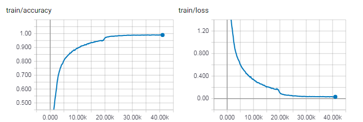

# VGG19-FCN for Image Classification
 - TensorFlow implementation of [Very Deep Convolutional Networks for Large-Scale Image Recognition](https://arxiv.org/abs/1409.1556). 
 - This repository contains the examples of natural image classification using pre-trained model as well as training a VGG19-like network from scratch on [CIFAR-10](https://www.cs.toronto.edu/~kriz/cifar.html) dataset (91.81% accuracy on testing set).

 
## Requirements
- Python 3.3+
- [TensorFlow 1.9+](https://www.tensorflow.org/)
- [Numpy](http://www.numpy.org/)
- [Scipy](https://www.scipy.org/)


## Implementation Details

- The VGG networks are defined in [`src/nets/vgg.py`](src/nets/vgg.py).
- An example of image classification using pre-trained model is in [`examples/vgg_pretrained.py`](examples/vgg_pretrained.py).
- An example of train a network from scratch on CIFAR-10 is in [`examples/vgg_cifar.py`](examples/vgg_cifar.py).

For testing the pre-trained model
- The last three fully connected layers are converted to convolutional layers making it a fully convolutional network. Then the input images can be arbitrary size.
- [Global average pooling](https://arxiv.org/abs/1312.4400) is used to get fix size of class scores for all the test images.
- Images are rescaled so that the smallest side equals 224 before fed into the model to reduce the computational complexity as well as keep the high classification performance, since for too large scale image, responses of relevant parts maybe averaged by responses of non-relevant of the image through global average pooling.  

For training from scratch on CIFAR-10
- The convolutional layers part is the same as VGG19. The fully connected layers are implemented as convolutional layers with filter size 1.
- Since CIFAR-10 contains smaller number of training set and classes than ImageNet, two fully connected layers consist of 1024 units are used before the output linear layer.
- [Batch normalization](https://arxiv.org/abs/1502.03167) for all of the layers except the output layer. All the activation functions are ReLUs.
- During training, dropout with keep probability 0.4 is applied to two fully connected layers. I have tried to add dropout after each max pooling layers, but it harms the performance both for training and testing set. Weight decay with 5e-4 is used as well.
- The network is trained through Adam optimizer. Batch size is 128. The initial learning rate is 1e-3, decays to 1e-4 after 50 epochs, and finally decays to 1e-5 after 70 epochs. 
- Each color channel of the input images are subtracted by the mean value computed from the training set.

## Usage
### ImageNet Classification
- Download pre-trained VGG19 model
Download the pre-trained parameters VGG19 NPY [here](https://www.dropbox.com/sh/dad57t3hl60jeb0/AADlcUshCnmN2bAZdgdkmxDna?dl=0). This is original downloaded from [here](https://github.com/machrisaa/tensorflow-vgg#tensorflow-vgg16-and-vgg19).
- Setup path
In [`examples/vgg_pretrained.py`](examples/vgg_pretrained.py):

 `VGG_PATH` is the path for pre-trained vgg model.
 `DATA_PATH` is the path to put testing images.

- Run
Go to `examples/` and put test image in folder `DATA_PATH`, then run the script:

```
python vgg_pretrained.py --im_name PART-OF-IMAGE-NAME
```
`--im_name` is the option for image names you want to test. If the testing images are all `png` files, this can be `png`. The default setting is `.jpg`.


The output will be the top-5 class labels and probabilities.

### Train the network on CIFAR-10
- Download dataset
Download CIFAR-10 dataset from [here](https://www.cs.toronto.edu/~kriz/cifar.html)
- Setup path
In [`examples/vgg_cifar.py`](examples/vgg_cifar.py):

 `DATA_PATH` is the path to put CIFAR-10.
 `SAVE_PATH` is the path to save or load summary file and trained model.

- Train the model
Go to `examples/` and run the script:

```
python vgg_cifar.py --train --lr LEARNING-RATE --bsize BATCH-SIZE --keep_prob KEEP-PROB-OF-DROPOUT
--maxepoch MAX-TRAINING-EPOCH
```
Summary and model will be saved in `SAVE_PATH`. You can download one pre-trained model on CIFAR-10 [here](https://www.dropbox.com/sh/pka0tur7yz2cdpk/AADM0rJNiB3pkf4tXYtMwsGKa?dl=0).

- Evaluate the model
Go to `examples/` and put the pre-trained model in `SAVE_PATH`. Then run the script:

```
python vgg_cifar.py --eval --load PRE-TRAINED-MODEL-ID
```
The pre-trained ID is epoch ID shown in the save modeled file name. The default value is `104`, which indicates the one I uploaded. The output will be the accuracy of training and testing set.

## Results
### Image classification using pre-trained VGG19 model
Top five prediction (VGG19) are shown. The probabilities are shown keep two decimal places. Note that the pre-trained model are trained on [ImageNet](http://www.image-net.org/).

*Data Source* | *Image* | *Result* |
|:--|:--:|:--|
[COCO](http://cocodataset.org/#home) || 1: probability: 1.00, label: brown bear, bruin <br>2: probability: 0.00, label: American black bear, black bear <br>3: probability: 0.00, label: ice bear, polar bear <br>4: probability: 0.00, label: sloth bear, Melursus ursinus <br>5: probability: 0.00, label: chow, chow chow
[COCO](http://cocodataset.org/#home) || 1: probability: 0.61, label: street sign<br>2: probability: 0.27, label: traffic light, traffic signal, stoplight<br>3: probability: 0.02, label: mailbox, letter box<br>4: probability: 0.02, label: parking meter<br>5: probability: 0.01, label: pay-phone, pay-station
[COCO](http://cocodataset.org/#home) ||1: probability: 0.48, label: passenger car, coach, carriage<br>2: probability: 0.36, label: trolleybus, trolley coach, trackless trolley<br>3: probability: 0.10, label: minibus<br>4: probability: 0.02, label: school bus<br>5: probability: 0.01, label: streetcar, tram, tramcar, trolley, trolley car
[COCO](http://cocodataset.org/#home) ||1: probability: 0.17, label: burrito<br>2: probability: 0.13, label: plate<br>3: probability: 0.10, label: Dungeness crab, Cancer magister<br>4: probability: 0.06, label: mashed potato<br>5: probability: 0.06, label: guacamole
[ImageNet](http://www.image-net.org/) ||1: probability: 1.00, label: goldfish, Carassius auratus<br>2: probability: 0.00, label: rock beauty, Holocanthus tricolor<br>3: probability: 0.00, label: anemone fish<br>4: probability: 0.00, label: coral reef<br>5: probability: 0.00, label: puffer, pufferfish, blowfish, globefish
Self Collection | |1: probability: 0.33, label: tabby, tabby cat<br>2: probability: 0.20, label: Egyptian cat<br>3: probability: 0.11, label: tiger cat<br>4: probability: 0.03, label: Cardigan, Cardigan Welsh corgi<br>5: probability: 0.02, label: bookcase
Self Collection | |1: probability: 1.00, label: streetcar, tram, tramcarr<br>2: probability: 0.00, label: trolleybus, trolley coach<br>3: probability: 0.00, label: passenger car, coach, carriage<br>4: probability: 0.00, label: electric locomotive<br>5: probability: 0.00, label: minibus

### Train the network from scratch on CIFAR-10
learning curve for training set 



learning curve for testing set 
- The accuracy on testing set is 91.81% around 100 epochs. We can observe the slightly over-fitting behavior at the end of training.


   
## Author
Qian Ge
